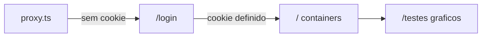

# Login e Gerenciador de Containers

## Objetivo
- Mover o dashboard de gráficos atual de `/` para `/testes`.
- Criar tela de `/login` (aceita qualquer usuário/senha) com proteção de rotas.
- Tornar `/` o gerenciador de containers locais (dados mock) com ações iniciar, parar e pausar.

## 1. Mover o dashboard para /testes
- Criar `src/app/testes/page.tsx` com o conteúdo atual de [src/app/page.tsx](src/app/page.tsx) (componente `Home` renomeado para `TestesPage`), mantendo `usePanels` e os componentes de gráfico intactos.
- O arquivo `src/app/page.tsx` passa a ser a tela de containers (item 3).

## 2. Login + proteção de rotas (Next.js 16)
- `src/lib/auth.ts`: helpers de cookie (`AUTH_COOKIE = "dash_auth"`), `setAuthCookie`, `clearAuthCookie`, `isAuthenticated`.
- `src/app/login/page.tsx` (client component): formulário com campos usuário e senha. Ao enviar, aceita qualquer valor não vazio, grava o cookie `dash_auth` via `document.cookie` e redireciona para `/` com `useRouter().push("/")`. Segue o padrão visual dark/Tailwind existente (cores `--background`, `--card`, `--border`, `--accent`).
- `src/proxy.ts` (equivalente ao middleware no Next 16 — ver `node_modules/next/dist/docs/01-app/01-getting-started/16-proxy.md`): lê o cookie `dash_auth`; se ausente em rota protegida, `NextResponse.redirect` para `/login`; se presente e acessando `/login`, redireciona para `/`. `config.matcher` cobrindo `/` e `/testes` e excluindo assets/_next/login.
- Adicionar botão "Sair" (logout) que limpa o cookie e volta para `/login`, num cabeçalho/nav simples reutilizado nas telas autenticadas.

## 3. Gerenciador de containers (mock)
Seguindo o mesmo padrão de `usePanels` + `localStorage`:
- `src/lib/containers/types.ts`: `ContainerStatus = "running" | "paused" | "stopped"` e tipo `Container { id, name, image, status }`.
- `src/lib/containers/data.ts`: lista inicial de containers mock (ex.: nginx, postgres, redis).
- `src/hooks/useContainers.ts`: estado dos containers com persistência em `localStorage` (chave `dashboards.containers.v1`), padrão `hydrated` igual a [src/hooks/usePanels.ts](src/hooks/usePanels.ts), e ações:
  - `startContainer` (stopped/paused -> running)
  - `stopContainer` (-> stopped)
  - `pauseContainer` (running -> paused)
- `src/components/ContainerCard.tsx`: exibe nome, imagem e badge de status (cor por estado); abaixo, botões Iniciar / Parar / Pausar, desabilitados conforme o estado atual (ex.: Pausar só quando running).
- `src/app/page.tsx`: nova home que lista os containers com `useContainers`, renderizando um `ContainerCard` por item, com o cabeçalho/nav e botão Sair.

## Fluxo de navegação

## Observações
- Sem dependências novas: apenas React/Next/Tailwind já presentes.
- Login é apenas demonstrativo (qualquer usuário); cookie no cliente, sem backend de sessão real.
- Ao final: `npm run lint` (Biome) e verificar ausência de erros de tipo.