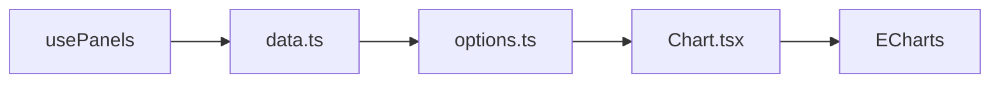

# Dashboards

Aplicação web para organizar gráficos em painéis personalizáveis, com dados simulados em tempo real. Construída com Next.js 16, React 19 e ECharts.

## Funcionalidades

- **Painéis** — crie, alterne e exclua conjuntos de gráficos via abas
- **6 tipos de gráfico** — linha, barra, área, pizza, medidor (gauge) e dispersão
- **Dados em tempo real** — séries simuladas atualizadas a cada 1,5 s
- **Pausar / Retomar** — interrompa ou retome a atualização dos dados
- **Redimensionamento** — arraste o canto dos cards para ajustar tamanho
- **Persistência** — painéis, gráficos e tamanhos salvos em `localStorage`
- **Tema escuro** — interface e gráficos com tema `dashboard-dark` customizado

## Stack

| Tecnologia | Uso |
|------------|-----|
| [Next.js 16](https://nextjs.org) | App Router, SSR/SSG |
| [React 19](https://react.dev) | Interface |
| [TypeScript](https://www.typescriptlang.org) | Tipagem |
| [Tailwind CSS v4](https://tailwindcss.com) | Estilos |
| [ECharts](https://echarts.apache.org) + [echarts-for-react](https://github.com/hustcc/echarts-for-react) | Gráficos |
| [Biome](https://biomejs.dev) | Lint e formatação |

## Pré-requisitos

- [Node.js](https://nodejs.org) 22 (ver [`.nvmrc`](.nvmrc))

Com [nvm](https://github.com/nvm-sh/nvm) instalado:

```bash
nvm use
```

## Instalação

```bash
npm install
```

## Scripts

| Comando | Descrição |
|---------|-----------|
| `npm run dev` | Servidor de desenvolvimento em [http://localhost:3000](http://localhost:3000) |
| `npm run build` | Build de produção |
| `npm run start` | Servidor de produção (após `build`) |
| `npm run lint` | Verificação com Biome |
| `npm run format` | Formatação automática com Biome |

## Estrutura do projeto

```
src/
├── app/
│   ├── layout.tsx      # Layout raiz, fontes Geist, tema escuro
│   ├── page.tsx        # Página principal do dashboard
│   └── globals.css     # Estilos globais e variáveis Tailwind
├── components/
│   ├── AddChartButton.tsx  # Menu para adicionar gráficos
│   ├── Chart.tsx           # Wrapper ECharts com tema e resize
│   ├── ChartCard.tsx       # Card redimensionável de um gráfico
│   └── PanelTabs.tsx       # Abas de painéis (criar, alternar, excluir)
├── hooks/
│   └── usePanels.ts        # Estado dos painéis, tick em tempo real, localStorage
└── lib/charts/
    ├── types.ts        # Tipos de gráfico, painel e dados
    ├── data.ts         # Geração e avanço de dados simulados
    └── options.ts      # Opções ECharts por tipo de gráfico
```

## Como usar

1. **Criar um painel** — clique em **+ Novo painel**, informe o nome e confirme
2. **Adicionar gráfico** — com um painel ativo, use **Adicionar gráfico** e escolha o tipo
3. **Alternar painéis** — clique na aba do painel desejado
4. **Pausar dados** — use **Pausar** no cabeçalho para congelar as atualizações
5. **Redimensionar** — arraste o canto inferior direito de um card de gráfico
6. **Remover** — use **Remover** no card ou **×** na aba do painel ativo

O estado é restaurado automaticamente ao recarregar a página (chave `dashboards.panels.v1` no `localStorage`).

## Arquitetura



O hook `usePanels` centraliza o estado (painéis, gráficos, pausa). A cada 1,5 s, `advanceData` atualiza os dados simulados; `buildOption` converte os dados em opções ECharts; o componente `Chart` renderiza com o tema `dashboard-dark` e redimensiona via `ResizeObserver`.
